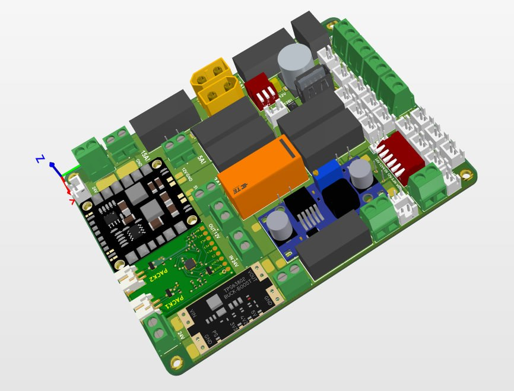
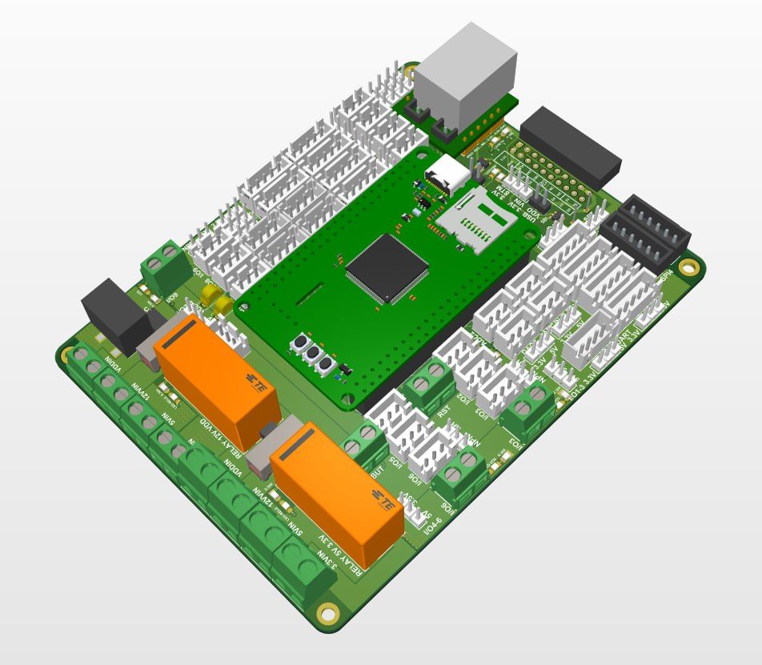
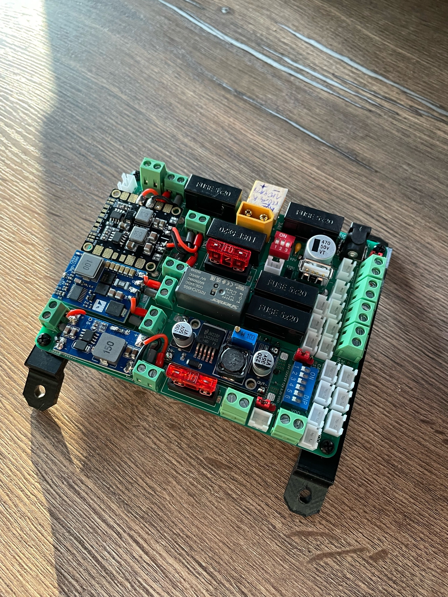
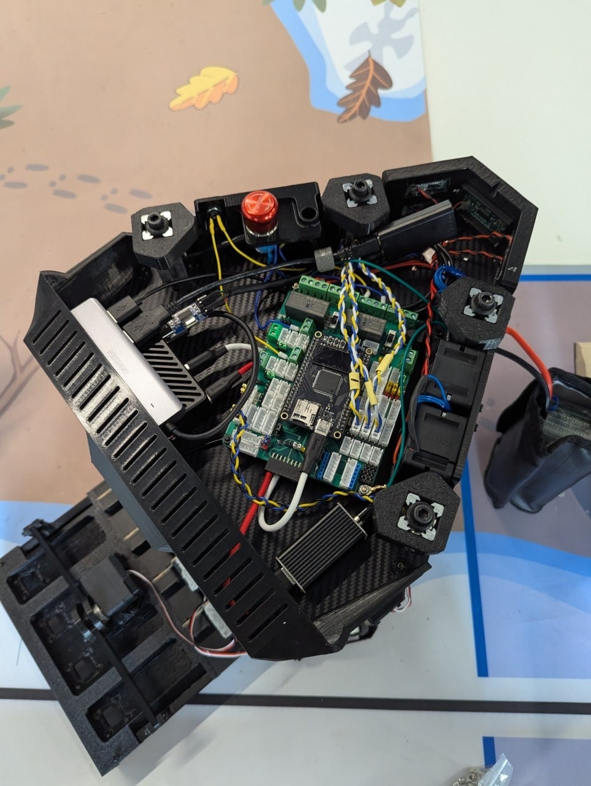
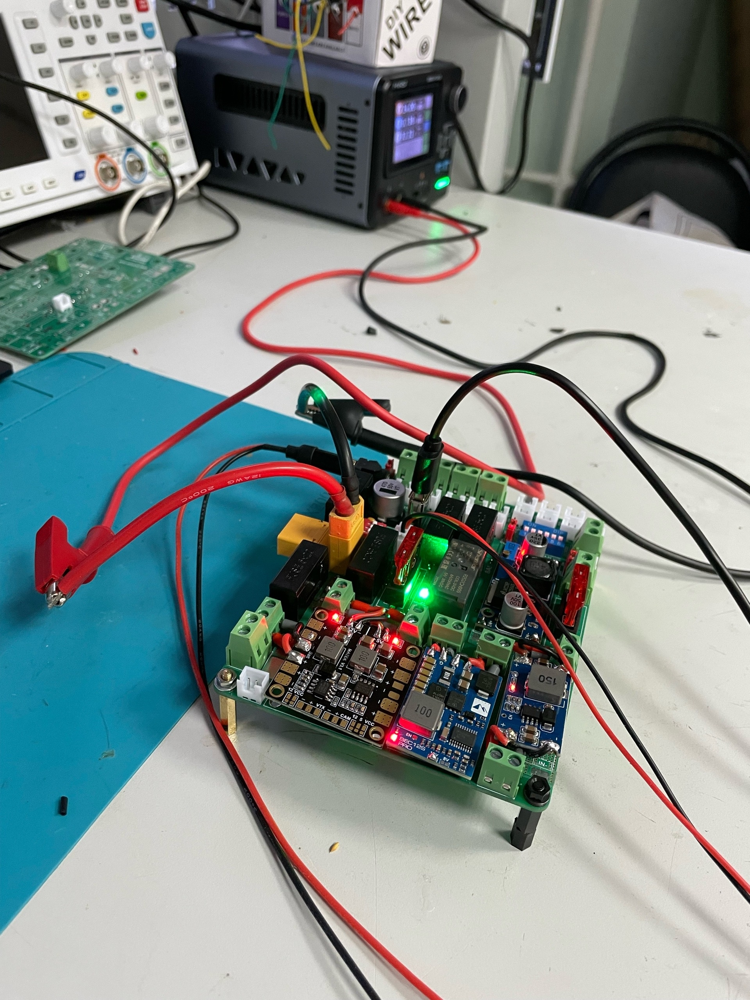
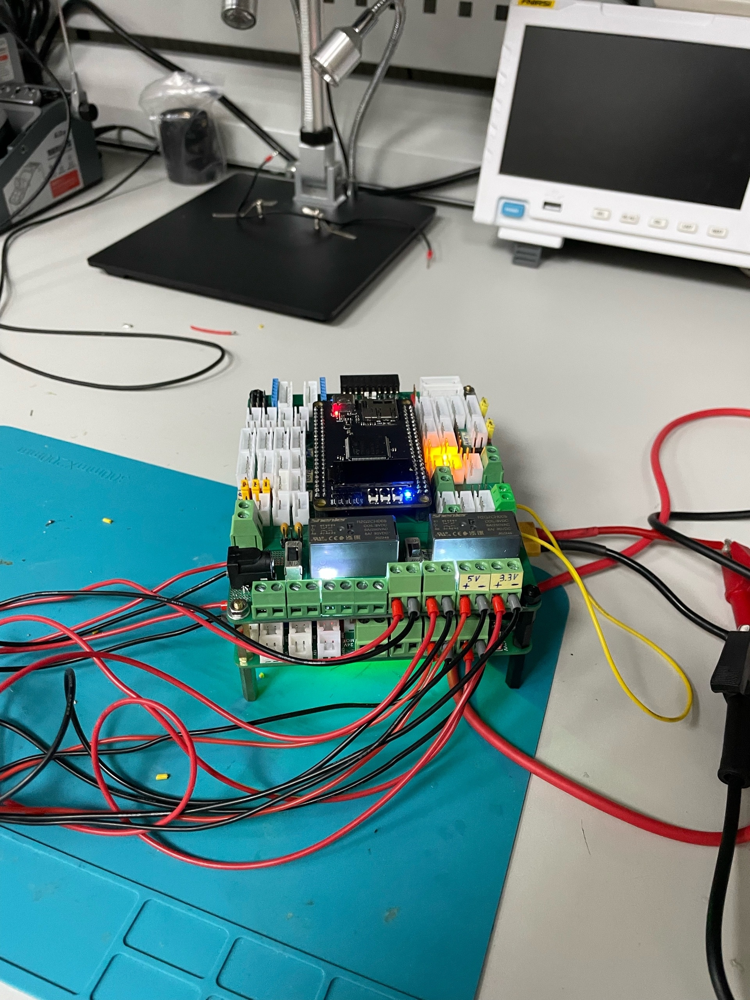
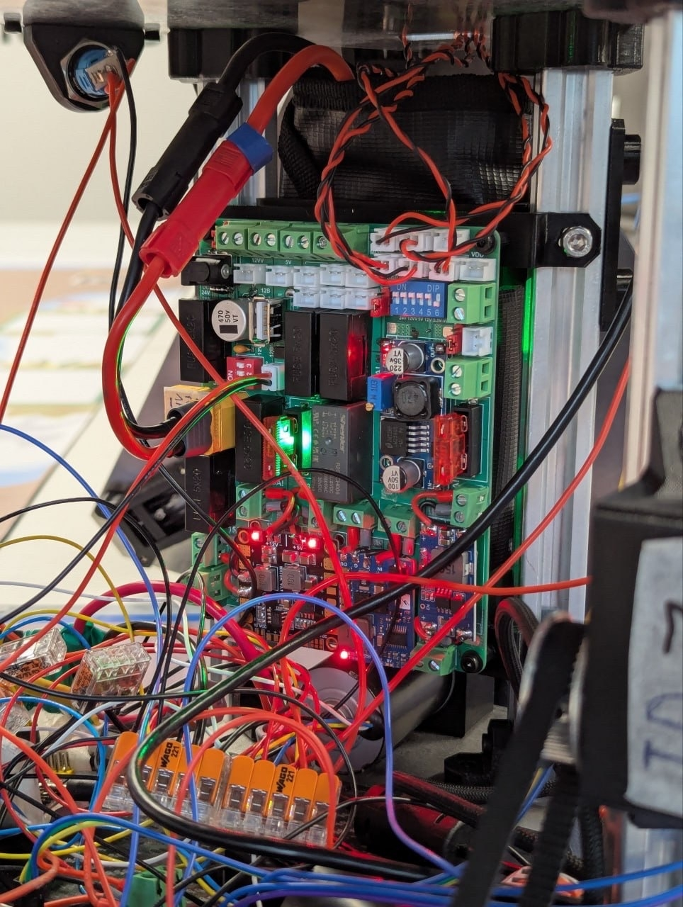

# EUROBOT 2026 — SCRAT PCB development
## Overview

**Welcome to the PCB development repository for the SCRAT robot of the Engi-Teams team for the Eurobot 2026 competition.** This project encompasses the complete PCB development for the SCRAT robot, including power distribution, control logic, and interface routing. The hardware architecture is built around the STM32H723VGT6 microcontroller (ARM Cortex-M7, 550 MHz) and features two dedicated boards — a Power Board and a Control Board. The design provides multiple regulated voltage rails ***(3.3 V, 5 V, 12 V, 24 V, and adjustable output)***, battery protection circuitry, ESD protection, and EMI filtering. Communication with the high-level PC stack is routed via USB CDC (HS) through micro-ROS‑compatible interfaces. To ensure high quality and stable operation of the robot, the complete PCB development cycle was divided into 10 main stages:


**`1`** Electronic Components Selection (ECS)  
**`2`** Incoming Inspection & Component Testing  
**`3`** Schematic Design  
**`4`** PCB Layout Design  
**`5`** Design Rule Verification (DRC, LVS)  
**`6`** Manufactured PCB Testing  
**`7`** Complete Assembly of All Electronic Modules  
**`8`** Electrostatic Discharge (ESD) Testing  
**`9`** Electromagnetic Compatibility (EMC) Testing  
**`10`** Final System Testing

<p align="center">
  
  <br>
  <em>3D model of the designed power board</em>
</p>

<p align="center">
  
  <br>
  <em>3D model of the designed control board</em>
</p>

## Repository Structure

```text
├── BOM/
│   ├── Control_PCB/                     # Components used in the control board
│   ├── Power_PCB/                       # Components used in the power board
│   └── Евробот_смета_2026.xlsx          # Bill of Materials with procurement links
├── CAD/
│   ├── Control PCB/                     # Electrical project of control PCB
│   ├── Layout PCB/                      # PCB layout files
│   ├── Library components/              # Component library elements
│   ├── PCB Rules                        # Design rules
│   ├── Power PCB/                       # Electrical project of power PCB
│   └── Stack_layer/                     # Layer stackup with materials and thicknesses
├── Docs/
│   ├── STM32H723VGT6.pdf                # STM Microcontroller documentation
│   └── Useful links.txt                 # Design tools list
├── Firmware/
│   └── Распиновка.docx                  # Control board pinout description
├── Gerber/
│   ├── Gerber_CONTROL_PCB/              # Manufacturing files of control PCB
│   └── Gerber_POWER_PCB/                # Manufacturing files of power PCB
├── Mech/
│   ├── 3d MODELS/                       # 3D models components (.step)
│   ├── PCB_CONTOL.step                  # 3D control PCB
│   └── PCB_POWER.step                   # 3D power PCB
└── Reports/
    ├── photos/                          # Testing photos
    └── docs/                            # Engineering documentation (.pdf)
```

## Key Technical Solutions

For a more detailed description of each section, please refer to the corresponding folders. The key solutions implemented in the developed boards are listed below:

① Magnetic Mounting for DC-DC Converters
Magnetic mounting for DC-DC converters enables quick module replacement in case of overheating or failure. This solution significantly simplified assembly, debugging, and reduced repair time.

② Comprehensive Power Supply System
Implemented voltage rails: 3.3 V, 5 V, 12 V, 24 V, and adjustable voltage from 3.3 to 24 V. This solution allows powering sensors, servos, motors, and other robot modules with different voltage requirements. The adjustable rail serves as a backup for connecting modules with non-standard supply voltages.

③ Battery Deep Discharge Protection
An integrated battery discharge control circuit disconnects the battery when the voltage drops below a user-adjustable threshold (set via potentiometer), protecting the battery from over-discharge.

④ Power and Logic Separation
To reduce noise coupling from power circuits to sensitive interface nodes, the power and low-voltage sections were separated into two distinct boards: Power Board and Control Board.

⑤ Independent Debugging
The ability to debug each board independently simplified the tuning of electronic modules inside the robot.

⑥ Redundant Interfaces
In addition to the main interfaces, the control board features expansion connectors for connecting additional sensors, actuators, and modules with interfaces not originally planned.

⑦ Overvoltage and ESD Protection
Built-in overvoltage and electrostatic discharge protection ensures the safety of sensitive components.

⑧ Switchable Filtering System
The power board implements a switchable filtering system using a capacitor array on each power rail, reducing the impact of internal power supply noise on the control board nodes.


---

## Manufacturing and Assembly

Both boards were manufactured at the **Resonit** factory (Moscow, Russia). Soldering and assembly were performed in our in-house laboratory. For convenient and reliable connections, XH2.54 connectors and pin headers were used, providing fast and secure wiring. LED indicators were added for visual status monitoring of key modules.

| | |
|:---:|:---:|
|  |  |
| *Assembled power board* | *Assembled control board* |

---

## Testing

A temporary laboratory test bench was assembled for PCB testing, equipped with the following measurement and control instruments:
- Oscilloscope
- Multimeter
- Power supply
- Signal analyzer
- Function generator

| | |
|:---:|:---:|
|  |  |
| *Power board testing* | *Control board testing* |
---
## Protection and Noise Immunity

### Grounding

To enhance reliability and protect against electrostatic discharge, both boards are connected to the common robot chassis and grounded through a dedicated metal contact at the bottom of the housing. Additionally, the motor power circuits are grounded, eliminating potential breakdowns and interference. These measures significantly increased the system's fault tolerance and ensured stable operation of the electronics.

### Shielding and Interference Suppression

To suppress parasitic coupling and electromagnetic interference, all signal lines were implemented as twisted pairs, which reduced crosstalk. In critical nodes, clock frequencies were optimized — reduced to the minimum acceptable values without affecting overall system performance.

---

## Final Results

Final testing confirmed the high reliability of the system: the robot started successfully on the first attempt, demonstrating flawless operation of all modules. This result was achieved through thorough design, step-by-step debugging, and comprehensive implementation of protective measures — proper shielding, frequency optimization, signal buffering, and a well-designed grounding scheme.

| |
|:---:|
|  |
| *Power boards installed in the robot* |

## Contact

For collaboration inquiries and additional information, please contact the project developers.

---

**© 2026 | This project was developed as part of the All-Russian Youth Robotics Competition EuroBot**
